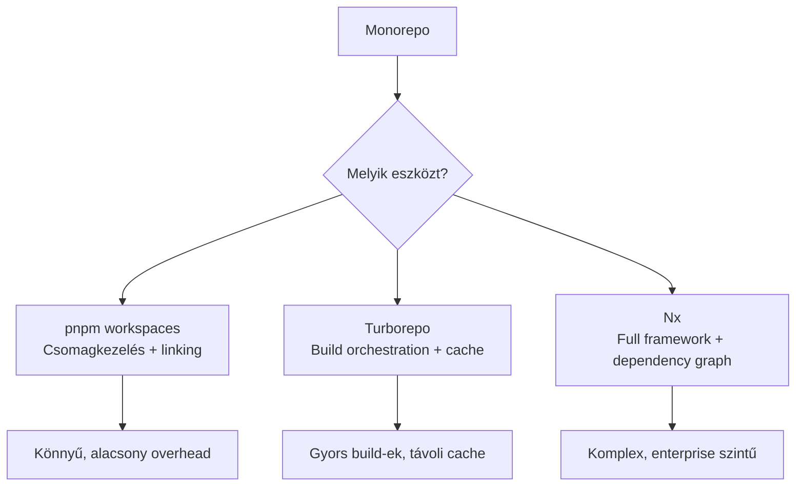

---
tags:
  - eszkoz
  - dev-tool
  - nodejs
  - workflow
datum: 2026-03-06
szint: "🏗️ Builder"
kapcsolodo:
  - "[[foundations/csomagkezelok-es-cli-toolok|Csomagkezelők és CLI toolok]]"
  - "[[foundations/projekt-szintu-izolacio|Projekt-szintű izoláció]]"
  - "[[cloud/ci-cd-pipelines|CI/CD Pipelines]]"
  - "[[frontend/nextjs|Next.js]]"
  - "[[_moc/moc-environment-setup|MOC - Environment Setup]]"
---

# Monorepo management

## Összefoglaló

Egy **monorepo** egyetlen Git repository, amiben több, egymáshoz kapcsolódó projekt (package) él együtt. A Next.js frontend, a backend API, a shared utility könyvtár és a config csomagok mind egy helyen — közös verziókezeléssel, közös CI/CD pipeline-nal, és közös tooling-gal.

## Miért monorepo?

A hagyományos multi-repo megközelítésnél minden projekt külön repóban van. Ez egyszerű két projektnél, de problémás lesz amint nő a csapat:

| Probléma | Multi-repo | Monorepo |
|----------|-----------|----------|
| Shared kód | npm package-ként publikálod, verzió hell | Lokális import, mindig friss |
| Dependency frissítés | Minden repóban külön PR | Egy PR, minden csomag frissül |
| CI/CD | N darab pipeline N repóhoz | Egy pipeline, ami tudja melyik package változott |
| Onboarding | 5 repó klónozás, 5 különböző setup | Egy `git clone`, egy `npm install` |

## Az eszközök



### pnpm workspaces

A [[foundations/csomagkezelok-es-cli-toolok|pnpm]] workspace az alap: egyetlen `node_modules` root, symlink-elt lokális csomagok, hatékony lemezhasználat.

```yaml
# pnpm-workspace.yaml (a repo gyökerében)
packages:
  - "apps/*"
  - "packages/*"
```

```
monorepo/
├── pnpm-workspace.yaml
├── package.json
├── apps/
│   ├── web/              # Next.js frontend
│   │   └── package.json
│   └── api/              # Backend API
│       └── package.json
└── packages/
    ├── ui/               # Shared UI komponensek
    │   └── package.json
    └── config/           # Shared konfiguráció
        └── package.json
```

**Lokális package hivatkozás:**

```json
// apps/web/package.json
{
  "dependencies": {
    "@myapp/ui": "workspace:*",
    "@myapp/config": "workspace:*"
  }
}
```

A `workspace:*` azt jelenti: "használd a lokális verziót" — nem npm-ről tölt le, hanem symlink-el.

```bash
# Telepítés (a repo gyökerében)
pnpm install

# Egy adott package script futtatása
pnpm --filter web dev
pnpm --filter api build

# Minden package build-je
pnpm -r build
```

### Turborepo

A Turborepo a build orchestration réteg pnpm workspaces fölé. Két fő képessége:

1. **Task pipeline** — tudja, hogy `web:build` függ `ui:build`-tól, tehát helyes sorrendben futtat
2. **Cache** — ha egy package nem változott, nem build-eli újra (lokális és távoli cache)

```json
// turbo.json (a repo gyökerében)
{
  "$schema": "https://turbo.build/schema.json",
  "tasks": {
    "build": {
      "dependsOn": ["^build"],
      "outputs": [".next/**", "dist/**"]
    },
    "dev": {
      "cache": false,
      "persistent": true
    },
    "lint": {},
    "test": {
      "dependsOn": ["build"]
    }
  }
}
```

```bash
# Telepítés
pnpm add -D turbo -w

# Minden package build-je (cache-elt)
turbo build

# Csak a változott package-ek build-je
turbo build --filter=...[HEAD~1]

# Dev szerver indítása
turbo dev
```

> [!tip] Remote cache
> A Turborepo remote cache-sel a CI-ben is kihasználhatod a cache-t. Ha egy csapattag már build-elte ugyanazt a kódot, neked nem kell újra. `turbo login` és `turbo link` a beállításhoz.

### Nx

Az Nx egy teljesebb framework — saját dependency graph, generátor-ok, plugin rendszer. Akkor érdemes, ha 10+ package-ed van és enterprise szintű kontrollra van szükséged.

```bash
# Nx monorepo létrehozása
npx create-nx-workspace@latest myapp

# Task futtatás
nx build web
nx affected:build    # csak a változott package-ek
nx graph             # dependency vizualizáció a böngészőben
```

## Melyiket válaszd?

| Szempont | pnpm workspaces | Turborepo | Nx |
|----------|----------------|-----------|-----|
| Komplexitás | Alacsony | Közepes | Magas |
| Setup idő | 5 perc | 15 perc | 30 perc |
| Cache | Nincs | Lokális + remote | Lokális + remote |
| Dependency graph | Nincs | Implicit | Explicit, vizuális |
| Generátorok | Nincs | Nincs | Beépített |
| Ideális | 2-5 package | 3-15 package | 10+ package |

> [!info] Kezdd egyszerűen
> Ha most indulsz, **pnpm workspaces + Turborepo** a legjobb kombó. Az Nx-re csak akkor lesz szükséged, ha a monorepo meghaladja a 10-15 package-et.

## CI/CD monorepo-val

A [[cloud/ci-cd-pipelines|CI/CD pipeline]]-ban a monorepo fő előnye: csak a változott package-eket build-eled és teszteled.

```yaml
# .github/workflows/ci.yml
name: CI

on:
  push:
    branches: [main]
  pull_request:

jobs:
  build:
    runs-on: ubuntu-latest
    steps:
      - uses: actions/checkout@v4
        with:
          fetch-depth: 2  # Turborepo-nak kell a diff

      - uses: pnpm/action-setup@v4
        with:
          version: 9

      - uses: actions/setup-node@v4
        with:
          node-version-file: '.nvmrc'
          cache: 'pnpm'

      - run: pnpm install
      - run: turbo build lint test
```

## Buktatók

- **node_modules hoisting** — pnpm strict isolation-t használ alapból, de ha egy package "elfelejtett" dependency-t használ ami más package-ből feljebb hoistolódott, `pnpm install --shamefully-hoist` ideiglenesen megoldja (de inkább javítsd a dependency-t)
- **TypeScript path alias** — monorepo-ban a `tsconfig.json` path-okat a root-ból kell megoldani, vagy `tsconfig` öröklődéssel (`"extends": "../../tsconfig.base.json"`)
- **Docker build** — monorepo-ból Docker image-et build-elni bonyolultabb, mert a context az egész repo. Turborepo `prune` parancs segít: `turbo prune --scope=web --docker`

## Kapcsolódó

- [[foundations/csomagkezelok-es-cli-toolok|Csomagkezelők és CLI toolok]] — npm, pnpm, bun különbségei
- [[foundations/projekt-szintu-izolacio|Projekt-szintű izoláció]] — az elv, amire a monorepo is épít
- [[cloud/ci-cd-pipelines|CI/CD Pipelines]] — automatizált build és deploy monorepo-khoz
- [[frontend/nextjs|Next.js]] — a leggyakoribb frontend app monorepo-ban
