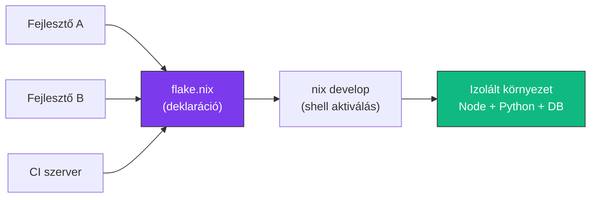

---
tags:
  - eszkoz
  - dev-tool
  - environment
datum: 2026-03-06
szint: "🏗️ Builder"
kapcsolodo:
  - "[[foundations/projekt-szintu-izolacio|Projekt-szintű izoláció]]"
  - "[[toolbox/fnm|fnm]]"
  - "[[toolbox/dev-containers|Dev Containers]]"
  - "[[foundations/csomagkezelok-es-cli-toolok|Csomagkezelők és CLI toolok]]"
  - "[[_moc/moc-environment-setup|MOC - Environment Setup]]"
---

# Nix

## Összefoglaló

A **Nix** egy deklaratív csomagkezelő és build rendszer, amivel **reprodukálható fejlesztői környezeteket** hozhatsz létre. Ahelyett, hogy kézzel telepítenéd a Node.js-t, Python-t, PostgreSQL-t és a többi eszközt, leírod egy fájlban — és Nix garantálja, hogy mindenkinél **pontosan ugyanaz** a verzió fut.

## Mi a problémát oldja meg?

A hagyományos megközelítés: minden fejlesztő kézzel telepíti az eszközöket ([[foundations/csomagkezelok-es-cli-toolok|brew]], apt, stb.), és hamar eltérnek a verziók.

```
Fejlesztő A:  Node 22.1.0, Python 3.12, PostgreSQL 16.2
Fejlesztő B:  Node 22.3.0, Python 3.11, PostgreSQL 16.1
CI szerver:   Node 22.0.0, Python 3.12, PostgreSQL 15.4
→ "Nálam működik" szindróma
```

Nix-szel:

```
flake.nix → Node 22.1.0, Python 3.12, PostgreSQL 16.2
Mindenkinél. Mindig. Garantáltan.
```



## Nix vs más eszközök

| Szempont | brew / [[toolbox/fnm\|fnm]] | Docker / [[toolbox/dev-containers\|Dev Containers]] | Nix |
|----------|------|--------|-----|
| Reprodukálhatóság | Gyenge (verziók eltérhetnek) | Erős (konténer image) | Nagyon erős (hash-alapú) |
| Izoláció | Részleges (fnm: csak Node) | Teljes (konténer) | Teljes (Nix shell) |
| Overhead | Nulla | Docker daemon kell | Nulla runtime overhead |
| Tanulási görbe | Alacsony | Közepes | Magas |
| Sebesség | Gyors | Lassú (image build) | Gyors (binary cache) |

## Setup

### Telepítés

```bash
# macOS / Linux
curl --proto '=https' --tlsv1.2 -sSf -L https://install.determinate.systems/nix | sh -s -- install

# Ellenőrzés
nix --version
```

> [!tip] Determinate Systems installer
> A hivatalos Nix installer helyett a Determinate Systems installert használd — egyszerűbb, macOS-en jobban működik, és könnyen eltávolítható ha szükséges.

### Flakes engedélyezése

A Flakes a modern Nix workflow alapja. Alapból engedélyezett a Determinate installer-rel, de ha nem:

```bash
# ~/.config/nix/nix.conf
echo "experimental-features = nix-command flakes" >> ~/.config/nix/nix.conf
```

## Fejlesztői környezet definiálása

### `flake.nix` — a környezet leírása

```nix
# flake.nix (a projekt gyökerében)
{
  description = "My SaaS App dev environment";

  inputs = {
    nixpkgs.url = "github:NixOS/nixpkgs/nixos-unstable";
    flake-utils.url = "github:numtide/flake-utils";
  };

  outputs = { self, nixpkgs, flake-utils }:
    flake-utils.lib.eachDefaultSystem (system:
      let
        pkgs = nixpkgs.legacyPackages.${system};
      in {
        devShells.default = pkgs.mkShell {
          buildInputs = with pkgs; [
            # Runtime-ok
            nodejs_22
            python312

            # Csomagkezelők
            nodePackages.pnpm

            # Adatbázisok (fejlesztéshez)
            postgresql_16
            redis

            # CLI eszközök
            jq
            curl
            gh   # GitHub CLI
          ];

          shellHook = ''
            echo "Dev environment loaded: Node $(node -v), Python $(python3 --version)"
          '';
        };
      }
    );
}
```

### Környezet aktiválása

```bash
# Környezet belépés
nix develop

# Háttérben (ha direnv-vel használod)
# Automatikusan aktiválódik cd-nél (lásd direnv jegyzet)
```

> [!warning] Első futtatás lassú
> Az első `nix develop` letölti vagy fordítja a csomagokat — ez percekbe telhet. Utána cache-ből megy, szinte instant.

## `flake.lock` — a reprodukálhatóság kulcsa

A `flake.lock` rögzíti az összes dependency pontos verzióját (hash-eket). Commitold a repóba — ez garantálja, hogy mindenkinél ugyanaz fut.

```bash
# Lock fájl frissítése (amikor frissíteni akarod a verziókat)
nix flake update

# Csak egy input frissítése
nix flake update nixpkgs
```

## Gyakori minták

### Nix + direnv (ajánlott kombó)

A `direnv`-vel a Nix környezet automatikusan aktiválódik amikor belépsz a projekt mappába:

```bash
# .envrc (a projekt gyökerében)
use flake
```

Így nem kell kézzel `nix develop`-ot futtatnod — a `cd` elég.

### Nix egyedi scriptekkel

```nix
# flake.nix - scripts rész
devShells.default = pkgs.mkShell {
  buildInputs = with pkgs; [
    nodejs_22
    (writeShellScriptBin "dev" ''
      echo "Starting dev server..."
      npm run dev
    '')
    (writeShellScriptBin "db-reset" ''
      echo "Resetting database..."
      psql -f ./scripts/reset.sql
    '')
  ];
};
```

## Mikor használd és mikor NE

**Használd:**
- Csapatban dolgozol és fontos, hogy mindenkinél ugyanaz a környezet
- Több nyelv / runtime kell egy projektben (Node + Python + Rust)
- CI/CD-ben is ugyanazt a környezetet akarod használni
- Komplex dependency-k (natív könyvtárak, rendszer-szintű csomagok)

**NE használd:**
- Egyedül dolgozol egy egyszerű projekten — a brew + [[toolbox/fnm|fnm]] elég
- A csapat nem akarja megtanulni a Nix nyelvet — magas a belépési küszöb
- Gyors prototípus — a setup overhead nem éri meg
- Ha a [[toolbox/dev-containers|Dev Containers]] már megoldja a problémát

## Buktatók

- **Nix nyelv** — a Nix saját funkcionális nyelvet használ, ami szokatlan. Az első héten frusztráló, utána természetes lesz
- **macOS kompatibilitás** — nem minden Linux csomag fordul macOS-en. A `nixpkgs` nagy része igen, de exotic csomagoknál figyelj
- **Lemezterület** — a Nix store (`/nix/store`) gyorsan nő. Rendszeres `nix-collect-garbage -d` ajánlott
- **Binary cache** — ha egy csomag nincs a binary cache-ben, forrásból fordít. Ez lassú lehet. Az `nixos-unstable` channel-en a legtöbb csomag cache-elt

## Hasznos parancsok

```bash
nix develop              # Fejlesztői shell belépés
nix flake update         # Dependency-k frissítése
nix-collect-garbage -d   # Régi verziók törlése (lemezterület)
nix flake show           # Flake outputok listázása
nix build                # Projekt build-elése Nix-szel
nix run                  # Projekt futtatása Nix-szel
```

## Kapcsolódó

- [[foundations/projekt-szintu-izolacio|Projekt-szintű izoláció]] — az elv, aminek a Nix a legteljesebb megvalósítása
- [[toolbox/fnm|fnm]] — ha csak Node verziókezelés kell, fnm egyszerűbb
- [[toolbox/dev-containers|Dev Containers]] — alternatíva Docker-alapú izolációval
- [[foundations/csomagkezelok-es-cli-toolok|Csomagkezelők és CLI toolok]] — a csomagkezelő rétegződés, amibe a Nix beleillik
