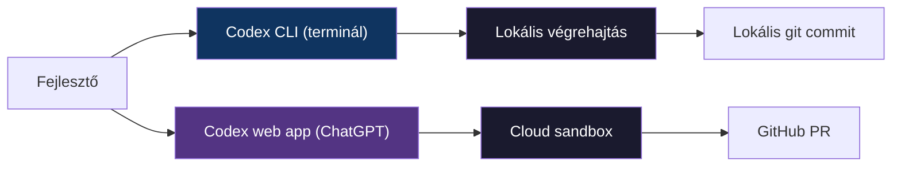

---
tags:
  - eszkoz
  - ai
  - dev-tool
datum: 2026-03-07
szint: "🧱 Scout"
kapcsolodo:
  - "[[toolbox/ai-coding-agentek-osszehasonlitasa|AI coding agentek összehasonlítása]]"
  - "[[toolbox/ai-first-fejlesztoi-workflow|AI-first fejlesztői workflow]]"
  - "[[toolbox/mcp-model-context-protocol|MCP — Model Context Protocol]]"
  - "[[_moc/moc-ai-tooling|MOC - AI Tooling]]"
---

# OpenAI Codex CLI

## Összefoglaló

A Codex az OpenAI AI coding agent-je. Két felülete van: a **Codex web app** (ChatGPT-be épített, aszinkron felhő agent) és a **Codex CLI** (terminálban futó lokális agent). Ez a jegyzet elsősorban a CLI változatot tárgyalja, de az aszinkron cloud modellt is bemutatja.

A Codex különlegessége az **aszinkron végrehajtás**: elindítasz egy feladatot, és az eredmény GitHub PR-ként érkezik — nem kell várnod, amíg dolgozik.

---

## Codex CLI vs Codex web app



| | Codex CLI | Codex web app |
|---|-----------|---------------|
| **Interfész** | Terminál | ChatGPT webes felület |
| **Végrehajtás** | Lokális gépen | Cloud sandbox (konténer) |
| **Eredmény** | Lokális fájlváltoztatás | GitHub PR |
| **Aszinkron** | Nem (interaktív) | Igen (indítsd el, gyere vissza) |
| **Párhuzamos task-ok** | Nem | Igen, több feladat egyszerre |
| **Modell** | Codex modell (GPT-5 alapú) | Codex modell (GPT-5 alapú) |

---

## Telepítés és setup

### CLI telepítés

```bash
npm install -g @openai/codex
```

### Autentikáció

A Codex CLI ChatGPT fiókkal működik — nem kell manuálisan API kulcsot beállítani. A `codex login` parancs böngészőn keresztül autentikál.

```bash
codex login
```

### Első futtatás

```bash
# Interaktív mód
codex

# Egyetlen feladat
codex "Add input validation to the login form"
```

---

## AGENTS.md — a Codex kontextus fájlja

Az `AGENTS.md` a Codex CLAUDE.md-je — a projekt gyökerében lévő fájl, ami kontextust ad az agent-nek.

```markdown
# AGENTS.md

## Setup
- Run `npm install` before making changes
- Use `npm test` to run the test suite

## Conventions
- Use TypeScript strict mode
- Follow the existing naming conventions
- All API routes go in `src/routes/`

## Architecture
- Next.js App Router
- Drizzle ORM with PostgreSQL
- Tailwind CSS for styling
```

> [!tip] CLAUDE.md → AGENTS.md konverzió
> Ha már van CLAUDE.md-d, az AGENTS.md nagyrészt ugyanazt tartalmazza. A formátum szinte azonos — mindkettő markdown, mindkettő a repó gyökerében van. Érdemes mindkettőt karbantartani, ha több tool-t is használsz.

---

## Működés — Cloud sandbox

A Codex web app egy **izolált cloud konténert** kap minden feladathoz:

1. **Repó klónozás** — a megadott GitHub repó klónozódik a sandboxba
2. **Környezet felépítés** — dependency-k telepítése az AGENTS.md alapján
3. **Feladat végrehajtás** — a Codex modell dolgozik a kódon
4. **PR létrehozás** — az eredmény automatikusan GitHub PR-ként jelenik meg
5. **Review** — te nézed át és merge-ölöd

```
Task indítás → Sandbox létrejön → Agent dolgozik → PR készül → Te review-zod
     ↑                                                              ↓
     └────────── Feedback loop (PR kommentek) ──────────────────────┘
```

### Párhuzamos feladatok

A web app-ban **több feladatot is indíthatsz egyszerre** — mindegyik saját sandbox-ban fut. Ez az egyik legnagyobb előny a szinkron tool-okkal szemben.

---

## Végrehajtási módok (CLI)

| Mód | Leírás | Flag |
|-----|--------|------|
| **Suggest** | Javasolja a változtatásokat, de nem hajtja végre | Alapértelmezett |
| **Auto Edit** | Automatikusan szerkeszti a fájlokat, shell parancsokhoz kér engedélyt | `--auto-edit` |
| **Full Auto** | Mindent automatikusan végrehajt | `--full-auto` |

```bash
# Suggest mód (alapértelmezett)
codex "Refactor the auth module"

# Full auto mód
codex --full-auto "Add unit tests for utils.ts"
```

---

## MCP támogatás

A Codex CLI támogatja az MCP szervereket, hasonlóan a Claude Code-hoz. A konfiguráció az `AGENTS.md`-ben vagy külön config fájlban történik.

---

## Mikor érdemes a Codex-et használni?

**Jó választás, ha:**
- Már fizetsz **ChatGPT Plus/Pro**-ért — a Codex benne van az előfizetésben
- **Aszinkron workflow** kell — indítsd el a feladatot reggel, délre kész a PR
- **GitHub-centrikus** a munkafolyamatod — PR-ként kapod az eredményt
- **Több feladatot** akarsz párhuzamosan futtatni
- OpenAI modelleket preferálod

**Nem ideális, ha:**
- Interaktív, iteratív munkát végzel (erre a CLI mód jobb, de Claude Code erősebb)
- Nem GitHub-on dolgozol
- Fontos a lokális kontroll és a teljes átláthatóság

---

## Összehasonlítás Claude Code-dal

| | Claude Code | Codex CLI |
|---|-------------|-----------|
| **Modell** | Claude (Anthropic) | GPT-5 Codex (OpenAI) |
| **Interfész** | Terminál (interaktív) | Terminál + web (aszinkron) |
| **Kontextus fájl** | CLAUDE.md | AGENTS.md |
| **Aszinkron** | Nem (de agent teams párhuzamos) | Igen (web app) |
| **MCP** | Natív | Támogatott |
| **Eredmény** | Lokális fájlváltoztatás | Lokális vagy GitHub PR |

---

## Kapcsolódó

- [[toolbox/ai-coding-agentek-osszehasonlitasa|AI coding agentek összehasonlítása]] — részletes összevetés más tool-okkal
- [[toolbox/ai-first-fejlesztoi-workflow|AI-first fejlesztői workflow]] — hogyan illeszkedik a Codex a napi munkába
- [[toolbox/mcp-model-context-protocol|MCP — Model Context Protocol]] — MCP szerverek a Codex-ben
