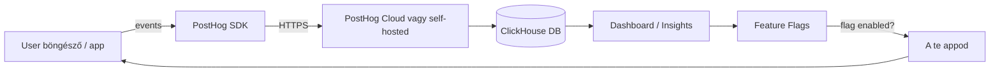

---
tags:
  - eszkoz
  - analytics
  - product-analytics
datum: 2026-03-06
szint: "🧱 Scout"
kapcsolodo:
  - "[[frontend/nextjs|Next.js]]"
  - "[[toolbox/grafana|Grafana]]"
  - "[[cloud/vercel|Vercel]]"
  - "[[cloud/railway|Railway]]"
  - "[[database/supabase|Supabase]]"
  - "[[backend/clerk|Clerk]]"
---

# PostHog

**Kategória:** `analytics` / `product analytics` / `feature flags`
**URL:** https://posthog.com
**Ár/Terv:** Cloud Free (1M event/hó, 15k session recording) / Scale (pay-as-you-go) / Self-hosted (ingyenes, open-source)

---

## Mi ez és mire jó?

> [!tldr] Egy mondatban
> A PostHog egy **nyílt forráskódú product analytics platform** — tudod ki használja az appod, mit csinál benne, hol hagy fel, és feature flag-ekkel kontrolálod, ki mit lát. Mixpanel + LaunchDarkly + FullStory egyben.

Claude Code megírja a kódot, [[cloud/railway|Railway]] vagy [[cloud/vercel|Vercel]] deploy-olja — de honnan tudod, hogy a felhasználók tényleg használják-e amit építettél? Melyik feature-t veszik igénybe? Hol adják fel az onboarding folyamatot? Erre való a PostHog.

**Főbb funkciók:**

| Funkció | Mi ez |
|---|---|
| **Event tracking** | Minden kattintás, navigáció, custom action rögzítése |
| **Session replay** | Videószerű visszajátszás — látod amit a user látott |
| **Funnels** | Hány user jutott el A-tól B-ig (pl. regisztráció → fizetés) |
| **Feature flags** | Progresszív rollout — csak bizonyos usereknek kapcsold be a featuret |
| **A/B testing** | Két verzió összehasonlítása valós user adatokkal |
| **Surveys** | In-app kérdőívek, NPS felmérések |
| **Heatmaps** | Hol kattintanak, hova scrolloznak |

**Mikor használd:**
- Tudni akarod hány user regisztrált, aktiválódott, churnolt
- Funnel analízis kell (pl. checkout abandonment)
- Feature flag-gel fokozatosan vezetsz be új funkcionalitást
- Session replay-jel debugolsz egy user problémát
- Ingyenes, GDPR-barát Mixpanel/Amplitude alternatíva kell

**Mikor NE használd:**
- Ha csak server-side metrikák kellenek (ott [[toolbox/grafana|Grafana]] jobb)
- Ha semmi user interakciót nem rögzítesz (pl. pure backend API)
- Ha a 1M/hó free tier bőven elég de te önállóan hosztolod feleslegesen

---

## Architektúra



---

## Setup — lépésről lépésre

### 1. Regisztráció / Projekt létrehozása

1. posthog.com → "Get started for free" → GitHub-bal
2. Projekt létrehozása → megkapod a **Project API Key**-t (`phc_xxx...`)
3. Régió választás: EU Cloud (GDPR-barátabb) vagy US Cloud

### 2. Next.js integráció (App Router)

```bash
npm install posthog-js
```

```typescript
// app/providers.tsx
'use client'
import posthog from 'posthog-js'
import { PostHogProvider } from 'posthog-js/react'
import { useEffect } from 'react'

export function PHProvider({ children }: { children: React.ReactNode }) {
  useEffect(() => {
    posthog.init(process.env.NEXT_PUBLIC_POSTHOG_KEY!, {
      api_host: process.env.NEXT_PUBLIC_POSTHOG_HOST ?? 'https://eu.i.posthog.com',
      capture_pageview: false, // App Router-rel manuálisan kezeljük
    })
  }, [])

  return <PostHogProvider client={posthog}>{children}</PostHogProvider>
}
```

```typescript
// app/layout.tsx
import { PHProvider } from './providers'

export default function RootLayout({ children }) {
  return (
    <html>
      <body>
        <PHProvider>{children}</PHProvider>
      </body>
    </html>
  )
}
```

### 3. Pageview tracking App Router-rel

```typescript
// components/PostHogPageView.tsx
'use client'
import { usePathname, useSearchParams } from 'next/navigation'
import { usePostHog } from 'posthog-js/react'
import { useEffect } from 'react'

export function PostHogPageView() {
  const pathname = usePathname()
  const searchParams = useSearchParams()
  const posthog = usePostHog()

  useEffect(() => {
    if (pathname && posthog) {
      posthog.capture('$pageview', {
        $current_url: window.location.href,
      })
    }
  }, [pathname, searchParams, posthog])

  return null
}
```

### 4. Custom event küldése

```typescript
import { usePostHog } from 'posthog-js/react'

export function BuyButton() {
  const posthog = usePostHog()

  const handleClick = () => {
    posthog.capture('purchase_clicked', {
      product_id: 'prod_123',
      price: 4990,
      currency: 'HUF',
    })
  }

  return <button onClick={handleClick}>Megveszem</button>
}
```

### 5. Server-side event (Node.js / Route Handler)

```bash
npm install posthog-node
```

```typescript
import { PostHog } from 'posthog-node'

const client = new PostHog(process.env.POSTHOG_API_KEY!, {
  host: 'https://eu.i.posthog.com',
})

// API route-ban vagy server action-ben
await client.capture({
  distinctId: userId,
  event: 'subscription_created',
  properties: {
    plan: 'pro',
    amount: 4990,
  },
})

await client.shutdown() // fontos: flush before exit
```

### 6. Environment változók (.env.local)

```bash
NEXT_PUBLIC_POSTHOG_KEY=phc_xxxxxxxxxxxxxxxxxxxxx
NEXT_PUBLIC_POSTHOG_HOST=https://eu.i.posthog.com
POSTHOG_API_KEY=phc_xxxxxxxxxxxxxxxxxxxxx  # server-side
```

---

## Feature Flags használata

Feature flag-gel fokozatosan lehet bevezetni funkciókat — pl. csak 10% user látja először, majd ha minden jó, mindenki.

```typescript
// Client-side
import { useFeatureFlagEnabled } from 'posthog-js/react'

export function NewDashboard() {
  const isEnabled = useFeatureFlagEnabled('new-dashboard')

  if (!isEnabled) return <OldDashboard />
  return <NewDashboard />
}
```

```typescript
// Server-side (pl. middleware vagy server component)
import { PostHog } from 'posthog-node'

const client = new PostHog(process.env.POSTHOG_API_KEY!)
const isEnabled = await client.isFeatureEnabled('new-dashboard', userId)

if (isEnabled) {
  // új verzió
}
```

> [!tip] Feature flag + [[database/supabase|Supabase]] user ID
> Ha [[database/supabase|Supabase]] auth-ot használsz, a `user.id`-t add át `distinctId`-ként. Így a PostHog és a Supabase user-ek 1:1-ben összekapcsolódnak, és a flag-ek per-user alapon működnek.

---

## Best Practices

### User azonosítás

```typescript
// Login után azonosítsd a usert
posthog.identify(user.id, {
  email: user.email,
  name: user.name,
  plan: user.plan,
})

// Logout után töröld az azonosítást
posthog.reset()
```

### Group analytics (pl. szervezetek)

```typescript
// Ha a user egy organization tagja
posthog.group('company', orgId, {
  name: org.name,
  plan: org.plan,
})
```

### Biztonság

- A **Project API Key** (`phc_xxx`) **publikus** — client-side kódba tehető
- A **Personal API Key** titkos — csak server-side, sosem kerülhet frontend kódba
- EU Cloud-ot használj ha EU felhasználóid vannak (GDPR)
- PII-t (email, name) csak `identify`-ban küldj, ne event property-ként

### Költségoptimalizálás

- Az 1M free event bőven elég kis appoknak — ne küldj felesleges event-eket
- `autocapture: false` beállítással csak a kézzel definiált event-ek mennek
- Session recording-nál a `minimum_session_duration` csökkenti a zajt

---

## Buktatók és hibák amiket elkerülj

> [!warning] `capture_pageview: false` App Router-rel
> Next.js App Router-nél állítsd be `capture_pageview: false`-ra az init-ben, különben minden pageview duplán jelenik meg (az SDK is küldi, te is). Manuálisan kezeld a `PostHogPageView` komponenssel.

> [!bug] Server-side `shutdown()` elfelejtése
> Node.js client-ben a `posthog.shutdown()` nélkül az event-ek elveszhetnek (buffer nem flush-ol). Serverless route handler-eknél mindig hívd meg request végén.

> [!warning] Localhost blokkolás
> Fejlesztés közben ad blocker-ek blokkolhatják a PostHog-ot. Proxy-n keresztüli küldéssel kikerülhető: PostHog docs → Reverse proxy setup.

---

## Hasznos linkek

- Docs: https://posthog.com/docs
- Next.js integráció: https://posthog.com/docs/libraries/next-js
- Dashboard: https://eu.posthog.com
- Státusz: https://status.posthog.com
- Self-hosted (Docker): https://posthog.com/docs/self-host

---

## Kapcsolódó

- [[frontend/nextjs|Next.js]] — PostHog SDK Next.js App Router-rel integrál (providers, pageview tracking)
- [[toolbox/grafana|Grafana]] — server-side metrikák és infra monitoring (PostHog kiegészítője, nem helyettesítője)
- [[cloud/vercel|Vercel]] — ha Vercel-en deployolsz, a PostHog SDK közvetlen integrál
- [[cloud/railway|Railway]] — self-hosted PostHog Railway-en is futtatható
- [[database/supabase|Supabase]] — user ID-t add át distinctId-ként az analitikában
- [[backend/clerk|Clerk]] — Clerk auth esetén a `userId`-t használd PostHog `identify`-ban
