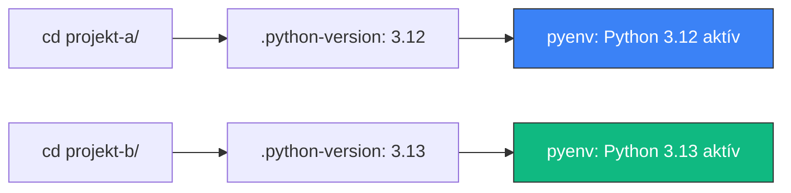

---
tags:
  - eszkoz
  - dev-tool
  - python
datum: 2026-03-06
szint: "🌱 Newcomer"
kapcsolodo:
  - "[[foundations/python-venv|Python venv]]"
  - "[[toolbox/fnm|fnm]]"
  - "[[foundations/projekt-szintu-izolacio|Projekt-szintű izoláció]]"
  - "[[foundations/csomagkezelok-es-cli-toolok|Csomagkezelők és CLI toolok]]"
  - "[[_moc/moc-environment-setup|MOC - Environment Setup]]"
---

# pyenv

## Összefoglaló

A **pyenv** egy Python verziókezelő — az [[toolbox/fnm|fnm]] Python-os megfelelője. Projektenként más Python verziót tudsz használni, és a `.python-version` fájl alapján automatikusan vált. Ahogy az fnm-nél a `.nvmrc`, itt a `.python-version` a kulcs.

## Miért kell?

A macOS-hez mellékelt Python verzió gyakran régi, és a `brew install python` is csak egy globális verziót ad. Ha két projekted van:

```
projekt-a/  → Python 3.12 kell (régebbi dependency-k)
projekt-b/  → Python 3.13 kell (legújabb feature-ök)
```

Brew-val ez nem megoldható — pyenv-vel igen.



## Setup

### 1. Telepítés

```bash
brew install pyenv
```

### 2. Shell konfiguráció

```bash
# .zshrc-be hozzáadni:
export PYENV_ROOT="$HOME/.pyenv"
export PATH="$PYENV_ROOT/bin:$PATH"
eval "$(pyenv init -)"
```

Ezután nyiss új terminált vagy futtass `source ~/.zshrc`-t.

### 3. Python verziók telepítése

```bash
# Elérhető verziók listázása
pyenv install --list | grep "^  3\."

# Telepítés
pyenv install 3.12.8
pyenv install 3.13.1

# Globális default beállítása
pyenv global 3.13.1

# Telepített verziók listázása
pyenv versions
```

> [!warning] Build dependency-k macOS-en
> A pyenv forrásból fordítja a Python-t. Előtte telepítsd a build dependency-ket:
> ```bash
> brew install openssl readline sqlite3 xz zlib tcl-tk
> ```
> Enélkül a `pyenv install` hibával leáll.

### 4. Projekt beállítás

```bash
cd my-python-project

# Projekt-szintű verzió beállítása
pyenv local 3.12.8
# Ez létrehoz egy .python-version fájlt
```

A `.python-version` fájl tartalma:
```
3.12.8
```

Ezután a mappában a `python` és `python3` parancsok automatikusan a 3.12.8-at használják.

## pyenv + venv — a teljes Python izoláció

A pyenv a **Python verziót** kezeli, a [[foundations/python-venv|venv]] a **csomagokat**. Együtt adják a teljes [[foundations/projekt-szintu-izolacio|projekt-szintű izolációt]]:

```bash
cd my-project

# 1. Python verzió beállítása (pyenv)
pyenv local 3.12.8

# 2. Virtuális környezet létrehozása (venv)
python -m venv .venv

# 3. Aktiválás
source .venv/bin/activate

# 4. Csomagok telepítése
pip install -r requirements.txt
```

| Réteg | Eszköz | Mit kezel |
|-------|--------|-----------|
| Python verzió | pyenv + `.python-version` | Melyik Python interpreter fut |
| Python csomagok | venv + `requirements.txt` | Milyen library-k vannak telepítve |

Ez pont az a rétegződés, amit a [[foundations/csomagkezelok-es-cli-toolok|csomagkezelők]] jegyzetben láttál: runtime (pyenv) és csomagkezelő (pip/venv) külön kezelve.

## Összehasonlítás: fnm vs pyenv

| Szempont | [[toolbox/fnm\|fnm]] (Node) | pyenv (Python) |
|----------|-----|-------|
| Nyelv | Rust | Shell script (C plugin) |
| Verzió fájl | `.nvmrc` | `.python-version` |
| Auto-váltás | `--use-on-cd` | Alapból (shim-ek) |
| Sebesség | Nagyon gyors | Gyors |
| Csomag izoláció | `node_modules` (automatikus) | `venv` (kézzel kell) |

## Alternatívák

### uv (modern, ajánlott új projektekhez)

Az **uv** (Rust-alapú) a pyenv + venv + pip kombinációját egyetlen eszközben oldja meg:

```bash
# uv mindent egyben kezel
uv init my-project     # projekt + venv + .python-version
uv add requests        # csomag telepítés
uv run script.py       # futtatás az izolált környezetben
```

> [!info] Mikor melyik?
> **Meglévő projekteknél** a pyenv + venv bevált és széles körben támogatott. **Új projekteknél** az uv egyszerűbb és gyorsabb alternatíva — de a pyenv ismerete akkor is hasznos, mert sok projekt és CI rendszer `.python-version` fájlt vár.

## Hasznos parancsok

```bash
pyenv install --list       # elérhető verziók
pyenv install 3.13.1       # verzió telepítése
pyenv versions             # telepített verziók
pyenv global 3.13.1        # globális default
pyenv local 3.12.8         # projekt-szintű verzió
pyenv shell 3.11.0         # ideiglenes (csak ez a shell)
pyenv uninstall 3.11.0     # verzió törlése
pyenv which python         # melyik python binaris fut
```

## Buktatók

- **Brew Python eltávolítása** — ha brew-val is van Python, a PATH ütközés lehet. Vagy távolítsd el (`brew uninstall python`), vagy győződj meg róla, hogy a pyenv shim-ek előbb vannak a PATH-ban
- **Új terminál kell** — a `.zshrc` módosítás után nyiss új terminált
- **Build hibák** — ha `pyenv install` hibát dob, valószínűleg hiányzó build dependency a probléma (lásd a telepítés szekciót)
- **`.python-version` commitolása** — mindig commitold a repóba, ahogy a `.nvmrc`-t is

## Kapcsolódó

- [[foundations/python-venv|Python venv]] — a pyenv a verziót kezeli, a venv a csomagokat
- [[toolbox/fnm|fnm]] — ugyanez a koncepció Node.js-re
- [[foundations/projekt-szintu-izolacio|Projekt-szintű izoláció]] — az elv, amit a pyenv megvalósít
- [[foundations/csomagkezelok-es-cli-toolok|Csomagkezelők és CLI toolok]] — hogyan illeszkedik a pyenv a csomagkezelő rétegekbe
