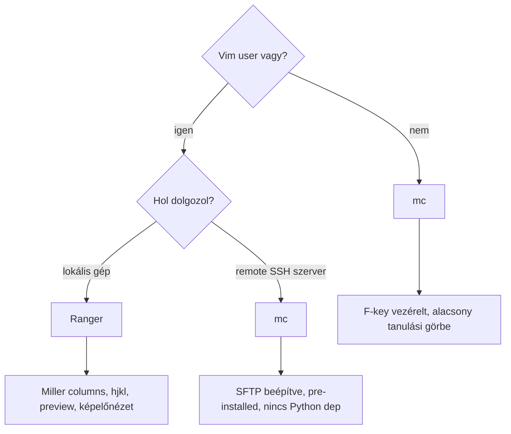

---
tags:
  - eszkoz
  - terminal
  - file-manager
datum: 2026-03-06
szint: "🌱 Newcomer"
kapcsolodo:
  - "[[toolbox/tmux|tmux]]"
  - "[[foundations/bash-es-linux-parancssor|Bash es Linux parancssor]]"
  - "[[toolbox/tailscale|Tailscale]]"
  - "[[toolbox/vi-editor|vi editor]]"
---

# Ranger

**Kategória:** `dev tool` / `terminal` / `file manager`
**URL:** https://github.com/ranger/ranger
**Ár/Terv:** Ingyenes, open source (Python)

---

## Mi ez és mire jó?

> [!tldr] Egy mondatban
> A Ranger egy **terminál alapú fájlkezelő Vim-os billentyűzettel** — háromoszlopos Miller columns nézettel navigálsz a fájlrendszerben, előnézeted van fájlokra, és soha nem kell elhagyni a terminált.

Ha Claude Code-ban dolgozol és gyorsan kell navigálni a projekt mappái között, fájlokat megnézni, vagy átrendezni — a Ranger lényegesen gyorsabb mint `ls`/`cd` kombók. A Vim-os logika (`hjkl`, `gg`, `G`, `/` keresés) rögtön ismerős.

**Mikor használd:**
- Lokálisan navigálsz komplex könyvtárstruktúrában (pl. monorepo)
- Fájl tartalmát gyorsan akarod előnézni anélkül, hogy megnyitnád
- [[toolbox/tmux|tmux]]-ban Claude Code mellett egy pane-ben fájlkezelő kell
- Képek/PDF-ek előnézete kell terminálban (kitty/iTerm2-vel)

**Mikor NE használd:**
- Remote szerveren nincs Python (ott az mc jobb, az mindenhol fut)
- SFTP/FTP böngészés kell (ott az mc tud SSH-n kapcsolódni)
- Régi VPS-en minimal setup van — mc sokkal kisebb lábnyom

---

## Ranger vs Midnight Commander — melyiket mikor?



### Összehasonlítás táblázat

| Tulajdonság | Ranger | Midnight Commander |
|---|---|---|
| **Layout** | 3 oszlopos Miller columns | 2 panel (Norton Commander stílusú) |
| **Keybindings** | Vim (`hjkl`, `gg`, `G`, `/`) | F1–F10 + kurzornyilak |
| **Telepítés** | `brew install ranger` / `pip3 install ranger-fm` | `brew install midnight-commander` |
| **Függőség** | Python 3 | C, szinte nulla dep |
| **Konfiguráció** | `rc.conf` (szöveges), Python script | Beépített dialógos UI |
| **Fájl előnézet** | Igen (text, kép, PDF, video) | Beépített viewer (F3) |
| **Képelőnézet** | Igen (kitty/w3m protokoll) | Nem |
| **Remote FS** | Nem (alap) | SFTP, FTP, SMB beépítve |
| **Beépített editor** | Nem (megnyitja a $EDITOR-t) | Igen (mcedit) |
| **Tanulási görbe** | Közepes (Vim logika) | Alacsony (F-key hints látszanak) |
| **Ideális eset** | Vim user, lokális navigáció | SSH szerver, beginnerek, remote FS |
| **Szín téma** | Igen, testreszabható | Igen, klasszikus kék |

> [!tip] Ökölszabály
> **Ranger** — ha a saját gépeden vagy Vim-os vagy. **mc** — ha szerveren vagy, vagy gyors egyszeri file műveletek kellenek és nem akarod megtanulni a Ranger keybinding-eket.

---

## Ranger setup

### 1. Telepítés

```bash
# macOS
brew install ranger

# Ubuntu/Debian
sudo apt install ranger

# Pip-pel (legfrissebb)
pip3 install ranger-fm
```

### 2. Konfig inicializálása

```bash
ranger --copy-config=all
# Létrehozza: ~/.config/ranger/rc.conf, rifle.conf, scope.sh, commands.py
```

### 3. Ajánlott rc.conf beállítások

```bash
# ~/.config/ranger/rc.conf

# Rejtett fájlok megjelenítése (. kezdetűek)
set show_hidden true

# Előnézeti panel megjelenítése
set preview_files true
set preview_directories true

# Fájlok ikona (Nerd Fonts szükséges)
set show_icons true

# Kilépéskor cd-zzen oda ahol jártál (lásd: shell integration alább)
map Q shell bash -c 'echo $PWD > /tmp/ranger_dir && ranger --choosedir=/tmp/ranger_dir'
```

### 4. Shell integráció — cd a kilépéskor

Ranger normál kilépéskor nem viszi magával a cd-t. Ez a wrapper megoldja:

```bash
# ~/.zshrc vagy ~/.bashrc
ranger() {
    local tmp="$(mktemp -t tmp.XXXXX)"
    command ranger --choosedir="$tmp" "$@"
    if [ -f "$tmp" ]; then
        local dir="$(cat "$tmp")"
        rm -f "$tmp"
        [ -d "$dir" ] && [ "$dir" != "$(pwd)" ] && cd "$dir"
    fi
}
```

Ezután `ranger` parancsra indítod, kilépéskor (`q`) a terminál abban a könyvtárban marad ahol jártál.

---

## Legfontosabb billentyűparancsok

### Navigáció

| Billentyű | Leírás |
|---|---|
| `h` | Szülő könyvtárba fel |
| `l` | Megnyitás / belépés mappába |
| `j` / `k` | Le / fel |
| `gg` | Lista elejére |
| `G` | Lista végére |
| `H` / `L` | Előző / következő history |
| `~` | Home könyvtár |

### Fájlműveletek

| Billentyű | Leírás |
|---|---|
| `yy` | Yank (copy) |
| `dd` | Cut |
| `pp` | Paste |
| `dD` | Törlés (delete) |
| `cw` | Átnevezés |
| `space` | Kijelölés (toggle) |
| `v` | Minden kijelölése |
| `uv` | Kijelölés megszüntetése |

### Nézet és keresés

| Billentyű | Leírás |
|---|---|
| `/` | Keresés az aktuális mappában |
| `n` / `N` | Következő / előző találat |
| `zh` | Rejtett fájlok toggle |
| `zp` | Preview toggle |
| `i` | Fájl info (részletes) |
| `W` | Log/parancsok panel |

### Tab kezelés (több hely egyszerre)

| Billentyű | Leírás |
|---|---|
| `Ctrl+n` | Új tab |
| `Tab` | Következő tab |
| `Shift+Tab` | Előző tab |
| `gc` | Tab bezárása |

### Fájl megnyitás

| Billentyű | Leírás |
|---|---|
| `Enter` | Megnyitás alapértelmezetten |
| `r` | Megnyitás kézzel választott programmal |
| `e` | Megnyitás $EDITOR-ban |

---

## Midnight Commander gyors referencia

Ha mc-t használsz (szerveren, vagy ha ismerős):

```bash
# Telepítés
brew install midnight-commander      # macOS
sudo apt install mc                  # Ubuntu
```

### F-key billentyűk

| Billentyű | Leírás |
|---|---|
| `F1` | Súgó |
| `F3` | Fájl megtekintése (viewer) |
| `F4` | Fájl szerkesztése (mcedit) |
| `F5` | Másolás (a másik panelbe) |
| `F6` | Áthelyezés / átnevezés |
| `F7` | Könyvtár létrehozása |
| `F8` | Törlés |
| `F9` | Menüsor aktiválása |
| `F10` | Kilépés |
| `Tab` | Váltás a két panel között |
| `Insert` | Fájl kijelölése |
| `Ctrl+O` | Shell a háttérbe (kilépés nélkül) |

### SSH kapcsolat mc-vel

```bash
# mc-vel közvetlenül böngészhetsz SSH szerveren
mc sftp://user@hostname
mc sftp://user@hostname/var/www

# Tailscale IP-vel is működik
mc sftp://100.x.x.x/home/user
```

> [!tip] mc + [[toolbox/tailscale|Tailscale]]
> Ha [[toolbox/tailscale|Tailscale]]-en át kapcsolódsz egy VPS-re, az mc SFTP módja kényelmes — nem kell külön terminált nyitni, a két panel közül az egyiken a szerver, a másikon a lokális gép van, F5-tel másolsz közöttük.

---

## Ranger + [[toolbox/tmux|tmux]] workflow

```
┌─────────────────────────┬──────────────────────────┐
│                         │                          │
│  claude                 │  ranger                  │
│                         │                          │
│  > Refaktoráld a        │  ~/Projects/app/         │
│    components mappát    │  ├── app/                │
│    ...                  │  ├── components/ ←       │
│                         │  └── lib/                │
│                         │                          │
└─────────────────────────┴──────────────────────────┘
```

```bash
# tmux pane-t nyitsz, Ranger-t indítod
tmux split-window -h
ranger

# Claude Code az egyik pane-ben dolgozik
# Ranger-ben közben navigálsz, fájlokat nézel meg
```

> [!info] Ranger mint context navigator
> Claude Code-ban a `/` paranccsal lehet fájlt megnyitni kontextusba, de ha nem tudod pontosan a path-ot, Ranger-rel gyorsan megtalálod, majd a teljes path-ot kimásolod (`yp` = yank path).

---

## Buktatók

> [!bug] `show_icons` Nerd Fonts nélkül
> Ha `set show_icons true` be van állítva de nincs Nerd Fonts telepítve (pl. a terminál fontja nem támogatja), fura karakterek jelennek meg. Ghostty-ban a font beállítás `font-family = "FiraCode Nerd Font"` megoldja.

> [!warning] Képelőnézet macOS-en
> Ranger képelőnézet csak kitty terminálban vagy iTerm2-ben működik automatikusan. Ghostty-ban a `kitty` protokoll limitált — telepítsd az `überzug++`-t: `pip3 install ueberzugpp`, és a `scope.sh`-ban aktiváld.

> [!warning] Ranger vs `lf` vs `yazi`
> Ranger Python-ban írt, ezért **lassabb** indulásra mint a Go-ban írt `lf` vagy a Rust-ban írt `yazi`. Ha gyors indulás kell, érdemes `yazi`-t megnézni — hasonló Vim logika, de sokkal gyorsabb.

---

## Hasznos parancsok

```bash
# Ranger indítása és cd on exit
ranger

# Ranger specifikus könyvtáron indítva
ranger ~/Projects/myapp

# Ranger konfigok helye
~/.config/ranger/rc.conf        # billentyűk, beállítások
~/.config/ranger/rifle.conf     # melyik program nyit meg mit
~/.config/ranger/scope.sh       # előnézet generálás logikája
~/.config/ranger/commands.py    # egyedi parancsok Python-ban

# Gyors keresés Ranger-ben (konzolból)
# ':' után: find <kifejezés> — szűri a listát
```

---

## Hasznos linkek

- Docs: https://github.com/ranger/ranger/wiki
- Konfig példák: https://github.com/ranger/ranger/wiki/Official-user-contributed-files
- Yazi (gyorsabb Rust alternatíva): https://github.com/sxyazi/yazi
- lf (Go alternatíva): https://github.com/gokcehan/lf

---

## Kapcsolódó

- [[toolbox/tmux|tmux]] — Ranger leggyakrabban egy tmux pane-ben fut Claude Code mellett
- [[foundations/bash-es-linux-parancssor|Bash es Linux parancssor]] — ha Ranger-ből kilépve `cd` kell, a shell integration ezt oldja meg
- [[toolbox/tailscale|Tailscale]] — mc SFTP módja Tailscale IP-n keresztül is működik szerveres file kezeléshez
- [[toolbox/vi-editor|vi editor]] — a Ranger Vim-es keybinding logikája erre épül (hjkl, yy, dd, /)
