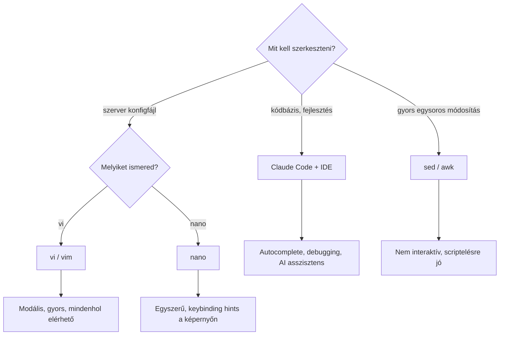

---
tags:
  - eszkoz
  - terminal
  - text-editor
datum: 2026-02-25
szint: "🌱 Newcomer"
kapcsolodo:
  - "[[toolbox/tmux|tmux]]"
  - "[[toolbox/ranger|Ranger]]"
  - "[[foundations/bash-es-linux-parancssor|Bash es Linux parancssor]]"
---

# vi editor

**Kategória:** `dev tool` / `terminal` / `text editor`
**URL:** https://www.vim.org
**Ár/Terv:** Ingyenes, open source

---

## Mi ez és mire jó?

> [!tldr] Egy mondatban
> A **vi** (és továbbfejlesztett változata a **Vim**) egy terminál alapú szövegszerkesztő, ami modális szerkesztéssel működik — az Insert módban írsz, a Normal módban navigálsz és parancsokat adsz.

A vi szinte **minden Unix/Linux rendszeren alapból telepítve van** — ez teszi nélkülözhetetlenné. Ha SSH-n egy szerverre csatlakozol, konfigfájlt kell szerkeszteni, vagy gyorsan kell valamit módosítani terminálban, a vi mindig ott van.

**Mikor használd:**
- Szerveren konfigfájl szerkesztése (`nginx.conf`, `.env`, `crontab`)
- Git commit message szerkesztés (ha a `$EDITOR` vi-re van állítva)
- [[toolbox/tmux|tmux]] session-ben gyors fájlszerkesztés Claude Code mellett
- Bármikor amikor nem tudsz GUI editort használni

**Mikor NE használd:**
- Nagyobb fejlesztési munka — ott Claude Code + modern editor jobb
- Ha nano-t ismered és gyors egyszeri szerkesztés kell — az egyszerűbb
- IDE funkciók kellenek (autocomplete, debugging, refactoring)

---

## vi vs nano vs modern editorok



| Tulajdonság | vi / vim | nano | VS Code / IDE |
|---|---|---|---|
| **Tanulási görbe** | Magas (modális logika) | Alacsony (hints a képernyőn) | Közepes (GUI) |
| **Elérhető szerveren** | Mindig | Általában igen | Nem (SSH kell) |
| **Sebesség** | Azonnali indulás | Azonnali indulás | Lassú (Electron) |
| **Bővíthetőség** | Vim: végtelen plugin ökoszisztéma | Minimális | Teljes IDE |
| **Használat Claude Code-dal** | tmux pane-ben, gyors edit | tmux pane-ben | Külön ablak |

---

## A három mód

A vi **modális editor** — más gombokat csinál más módban:

```
┌──────────────────────────────────────────────┐
│                                              │
│   NORMAL mód  ──── i ────►  INSERT mód      │
│   (navigáció,      ◄── Esc ──  (szöveg írás) │
│    parancsok)                                │
│       │                                      │
│       v ──────────►  VISUAL mód              │
│       ◄── Esc ──     (kijelölés)             │
│                                              │
│   : ──────────────►  COMMAND mód             │
│   (mentés, kilépés, keresés-csere)           │
│                                              │
└──────────────────────────────────────────────┘
```

> [!warning] A leggyakoribb buktató
> Aki először próbálja a vi-t, pánikol mert "nem tud kilépni". A megoldás: `Esc` → `:q!` (kilépés mentés nélkül) vagy `Esc` → `:wq` (mentés + kilépés).

---

## Legfontosabb parancsok

### Módváltás

| Parancs | Leírás |
|---|---|
| `i` | Insert mód (kurzor előtt) |
| `a` | Insert mód (kurzor után) |
| `o` | Új sor alul + Insert mód |
| `O` | Új sor felül + Insert mód |
| `Esc` | Vissza Normal módba |
| `v` | Visual mód (kijelölés) |
| `V` | Visual Line mód (egész sorok) |

### Navigáció (Normal módban)

| Parancs | Leírás |
|---|---|
| `h` `j` `k` `l` | Bal, le, fel, jobb |
| `w` / `b` | Szó előre / hátra |
| `0` / `$` | Sor elejére / végére |
| `gg` / `G` | Fájl elejére / végére |
| `Ctrl+d` / `Ctrl+u` | Fél oldal le / fel |
| `/{keresés}` | Keresés előre |
| `n` / `N` | Következő / előző találat |

### Szerkesztés (Normal módban)

| Parancs | Leírás |
|---|---|
| `dd` | Sor törlése |
| `yy` | Sor másolása (yank) |
| `p` | Beillesztés (paste) |
| `u` | Undo |
| `Ctrl+r` | Redo |
| `x` | Karakter törlése |
| `cw` | Szó cseréje (change word) |
| `.` | Utolsó parancs ismétlése |

### Mentés és kilépés (Command módban — `:` után)

| Parancs | Leírás |
|---|---|
| `:w` | Mentés |
| `:q` | Kilépés |
| `:wq` | Mentés + kilépés |
| `:q!` | Kilépés mentés nélkül |
| `:x` | Mentés + kilépés (rövidebb) |
| `:%s/régi/új/g` | Keresés-csere az egész fájlban |

---

## Gyakorlati tippek

> [!tip] Vim Tutor
> Terminálban írd be: `vimtutor` — ez egy interaktív 30 perces tutorial ami végigvezet az alapokon. A legjobb módja a tanulásnak.

> [!tip] Claude Code + vi
> Ha Claude Code-ban dolgozol és a `$EDITOR` vim-re van állítva, a `git commit` automatikusan vim-ben nyitja a commit message-et. Ha nem vagy kényelmes vim-mel, állítsd át: `export EDITOR=nano` a `~/.zshrc`-ben.

---

## Hasznos parancsok

```bash
# Editor beállítás shell-ben
export EDITOR=vim              # vim lesz az alapértelmezett editor
export EDITOR=nano             # ha nano-t preferálod

# Vim konfigfájl
~/.vimrc                       # személyes Vim beállítások

# Alapvető .vimrc
cat << 'EOF' > ~/.vimrc
set number          " Sorszámok megjelenítése
set relativenumber  " Relatív sorszámok
set tabstop=2       " Tab = 2 szóköz
set shiftwidth=2    " Indentálás = 2 szóköz
set expandtab       " Tab helyett szóközök
set hlsearch        " Keresési találatok kiemelése
set ignorecase      " Kis-nagybetű független keresés
set smartcase       " De nagybetű-érzékeny ha nagybetűt írsz
syntax on           " Szintaxis kiemelés
EOF
```

---

## Hasznos linkek

- Docs: https://www.vim.org/docs.php
- Vim Adventures (játékos tanulás): https://vim-adventures.com
- Vim Cheatsheet: https://vim.rtorr.com
- Neovim (modern Vim fork): https://neovim.io

---

## Kapcsolódó

- [[toolbox/tmux|tmux]] — vi/vim gyakran tmux pane-ben fut Claude Code mellett
- [[toolbox/ranger|Ranger]] — Vim-es keybinding-ekkel navigáló file manager, hasonló logika
- [[foundations/bash-es-linux-parancssor|Bash es Linux parancssor]] — a shell környezet amiben a vi fut
